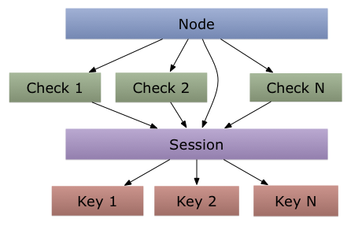

# Sessions

Consul 提供了一个会话机制，可用于构建分布式锁。
会话充当**节点**、**健康检查**和**KV数据**之间的绑定层。
它们被设计成可以提供**细粒度的锁**服务，并深受[“The Chubby Lock Service for Loosely-Coupled Distributed Systems”（低耦合分布式系统Chubby的锁服务）](http://research.google.com/archive/chubby.html)的启发。

> [!]本文将介绍Consul内部的技术细节，对于实际操作和使用Consul，你不需要知道这些细节。这些细节记录在这里为那些希望了解它们的人，小伙伴们不必再去探索源代码。

## Session Design

Consul 的 Session 是一种具有非常具体语义的契约。
Session创建时，需要提供**节点名**、**健康检查列表**、**行为**、一个**TTL**和 `lock-delay` 。会话会有一个 ID 进行唯一标示。
这个ID可以用于KV存储以获取锁:通过**互斥机制**。

下图显示了这些组件之间的关系:

Consul 约定在下列情况发生时 Session 会失效（*invalidated*）：

* 节点注销了
* 所有的健康检查被取消
* 所有的健康检查进入了临界状态
* 会话被摧毁了
* TTL 到期

当会话无效时，它被销毁，不能再使用。
锁的产生决于在创建时指定的行为。
Consul 支持`release`和 `delete` 行为。如果没有指定，则`release`行为是默认行为。

如果使用`release`行为，则会释放与会话关联的多有锁，并增加 Key 的`ModifyIndex`。
或者，如果使用`delete`行为，那么对于任何持有锁的键就会被简单地删除。
这可以用来创建由 Consul 自动删除的临时数据。

虽然设计简单，但它支持多种使用场景。
默认情况下，[基于Gossip的失败检测](internals/gossip-protocol.md)被用作健康检查。
这个故障检测器允许Consul检测一个持有锁的节点是否失败，并自动释放锁。
**liveness**为Concul锁提供了这种能力;也就是说，在失败的情况下，系统可以继续进行下去。
但是，由于没有完美的故障检测器，所以可能会出现错误的检测失败，导致锁被释放，即使锁的所有者仍然活着。
这意味着我们牺牲了一些安全（**safety**）。

相反，可以创建一个没有健康检查的会话。
这就消除了误判断的可能性 提升安全性。
即使所有者失败了，您也可以知道`Consul`不会释放锁。
由于`Consul` API 是允许一个 session 被强制销毁的，这就要求使用者在失败的情况下进行干预，同时排除了脑裂的可能性。

第三种健康检查机制是 session TTLs。
在创建会话时，可以指定TTL。
如果TTL到期，则会话已过期，并触发失效。
这种类型的故障探测器也称为心跳故障检测器。
它的可伸缩性比基于`Gossip`的故障检测器要小，因为它增加了服务器的负担，但在某些情况下可能适用。
在TTL到达之前，Consul不会终止会话，但是它可以推迟TTL过期的时间。
TTL可以在 会话创建、会话更新和 Leader变更 的时候进行更新。
在使用TTL的时候，客户端应该意识到时钟偏差（clock skew）问题:也就是说，在客户端上，时间可能会和Consul服务器的时间不一致。
最好设置一个保守TTL值，并在TTL之前更新，以避免网络延迟和时间倾斜。

最后的细微差别是会话可能会提供“lock-delay”。
这段时间在0到60秒之间。
当会话无效时，Consul阻止任何先前持有的锁被重新获得为`lock-delay`间隔;这是由谷歌的Chubby设计的一款保护装置。
延迟的目的是允许潜在的仍然活的领导者检测失效和停止处理请求，这可能导致不一致的状态。
虽然它不是一种防弹的方法，但它确实避免了将睡眠状态引入应用程序逻辑的需要，并且可以帮助缓解许多问题。
虽然它不是一种防弹的方法，但它确实避免了将睡眠状态引入应用程序逻辑的需要，并且可以帮助缓解许多问题。

## K/V Integration

KV存储和会话之间的集成是使用会话的主要场所。
会话必须在使用之前创建，然后由它的ID引用。

KV API被扩展以支持`acquire`和`release`操作。
`acquire`操作就像一个`Check-And-Set`操作，它只有在没有持有者(当前的锁持有者可以重新获得)的情况下才能成功。
在成功的时候，有一个正常的键更新，但是也有一个`LockIndex`的增量，并且 `Session` 值被更新，以反映持有锁的会话。

如果在`acquire`过程中已由会话持有锁，那么`LockIndex`就不会增加，但是`Key`的内容会被更新。
这使得当前的锁持有者无需放弃锁就可以更新`Key`内容。

一旦持有，锁可以使用相应的 `release` 操作释放，提供相同的会话。
同样，这类似于`Check-And-Set`操作，因为如果给定一个无效会话，请求将会失败。
关键的一点是，锁可以在不作为会话的创建者的情况下被释放。
这样设计是因为它允许操作人员进行干预和强制中断——如果必要的话，终止一个会话。
如上所述，会话失效也会导致所有持有的锁被释放或删除。
当锁被释放时，`LockIndex`不会改变;但是，`Session`被清除，`ModifyIndex`增加。

These semantics (heavily borrowed from Chubby), allow the tuple of (Key, LockIndex, Session) to act as a unique "sequencer". 
这些语义(从`Chubby`中大量借用)，允许(键`Key`、锁索引`LockIndex`、会话`Session`)的元组充当唯一的`sequencer`。
这个`sequencer`可以被传递，用于验证请求是否属于当前锁持有者。
因为`LockIndex`在每个`acquire`上增加了，即使相同的会话重新获得了一个锁，`sequencer`将能够检测到一个陈旧的请求。
类似地，如果会话无效，那么对应于给定`LockIndex`的会话将是空的。

显然，这种锁定系统纯粹是*advisory*。
没有强制要求客户端必须获得一个锁来执行任何操作。
任何客户机都可以读取、写入和删除密钥，而不拥有相应的锁。
Consul的目标不是保护不守规矩的客户。

## Leader Election

会话提供的原语和KV存储的锁定机制可以用来构建客户端领导的选举算法。
这些内容在[Leader Election 指南](guide/leader-election.md)中有更详细的介绍。

## Prepared Query Integration

`Prepared queries`可以附加到会话，以便在会话失效时自动删除。