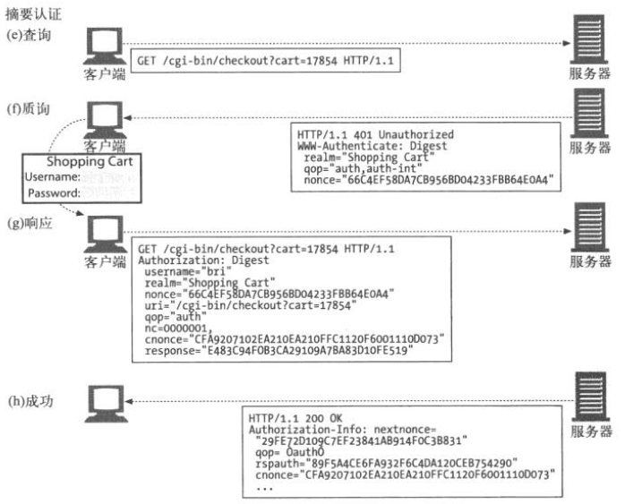

# 摘要认证

## Session

> **基本认证** 和 **摘要认证** 都是一种**无状态**的认证方式，就是**不需要服务器端保存必要的session，所以也没有session失效期**。
> **客户端每次都需要将密码和用户名发送给服务器来完成认证**，而且用户名和密码是保存在浏览器进程的内存中的，也就是只有当浏览器关闭的时候，用户名和密码也随之删除，才表示这次服务和认证结束，下一次请求需要重新输入用户名和密码。
> 
> 这两种方式都是浏览器产生输入用户名和密码的登录框。Basic认证采用了Base64编码，攻击者很容易获取http请求，然后解码请求就可以获取用户名和密码，没有安全性可言；
> 而Digest认证采用一中NONCE随机字符串，用户的每次认证都需要哈希和MD5（用户名和密码），并加入这个盐值，客户端和服务器端每次的NONCE都是不一样的，这样就保证了认证的安全性和不可重放性。
> 这里的NONCE并不是Session保存的一个字符串，这样就违背了无状态性特性。

## Read More
- [HTTP - 摘要认证](http://www.cnblogs.com/huey/p/5490759.html)
- [Http的四种认证方式](http://blog.csdn.net/u013177446/article/details/54135356)