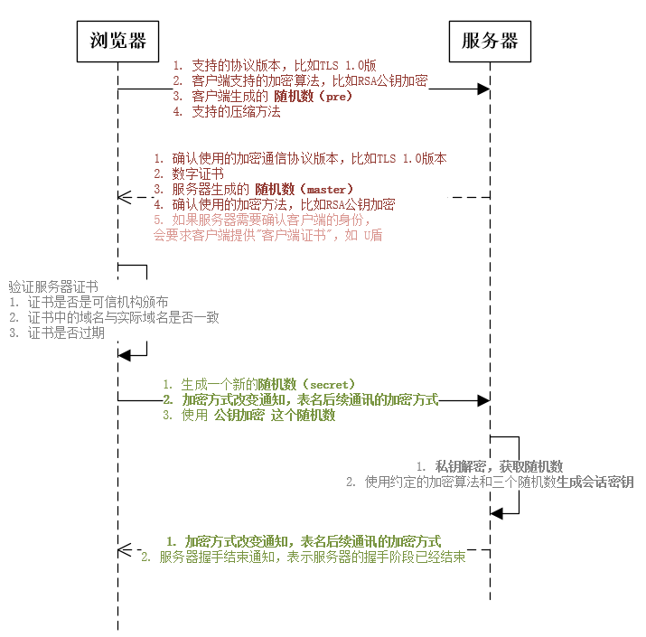

# SSL 握手

- 生成对话密钥一共需要三个随机数
- 握手之后的对话使用"对话密钥"加密（对称加密），服务器的公钥和私钥只用于加密和解密"对话密钥"（非对称加密），无其他作用
- 服务器公钥放在服务器的数字证书之中

## Read More
- [SSL/TLS协议运行机制的概述](http://www.ruanyifeng.com/blog/2014/02/ssl_tls.html)
- [图解SSL/TLS协议](http://www.ruanyifeng.com/blog/2014/09/illustration-ssl.html)
