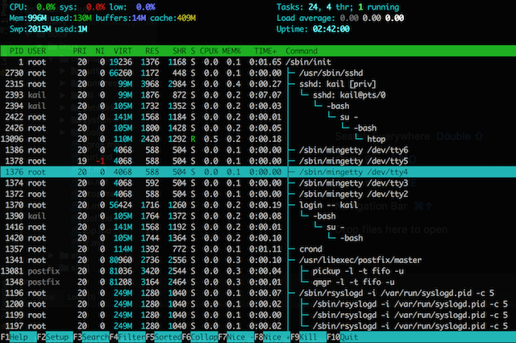

# htop

## 安装

``` bash
# 启用 EPEL Repository
yum -y install epel-release
yum -y update

# 安装 htop
yum -y install htop
```

输入 `htop` 即可使用，效果如下：




## Read More
> [官网](http://hisham.hm/htop/)  
> [Linux htop工具使用详解](http://www.open-open.com/lib/view/open1417612210323.html)  
