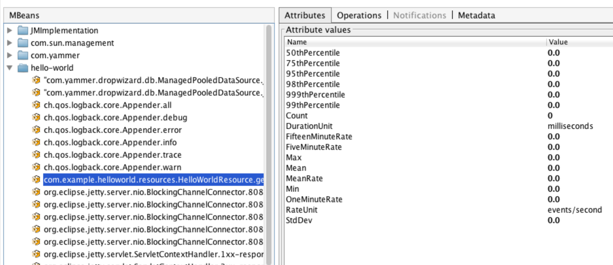

[TOC]


# 快速开始

本文将指导您完成将`Metrics`添加到现有应用程序的过程。
我们将通过`Metrics`提供的各种测量工具，介绍如何使用它们以及什么时候派上用场。

## 添加 Maven 依赖

``` xml
<dependencies>
    <dependency>
        <groupId>io.dropwizard.metrics</groupId>
        <artifactId>metrics-core</artifactId>
        <version>4.0.2</version>
    </dependency>
</dependencies>
```


现在是时候添加一些指标到您的应用程序！


## Meters

`Meter`测量一段时间内的事件发生率（例如，“每秒请求数”）。
In addition to the mean rate, meters also track 1-, 5-, and 15-minute moving averages.
除了平均速度之外，`Meter`还跟踪最近 `1`、`5`和`15`分钟的均线。


```
private final MetricRegistry metrics = new MetricRegistry();
private final Meter requests = metrics.meter("requests");

public void handleRequest(Request request, Response response) {
    requests.mark();
    // etc
}
```

这个例子将测量每秒请求的请求率。


## Console Reporter

`Console Reporter` 就像他的名字一样，报告到控制台. 这里将每秒打印一次。

```
ConsoleReporter reporter = ConsoleReporter.forRegistry(metrics)
       .convertRatesTo(TimeUnit.SECONDS)
       .convertDurationsTo(TimeUnit.MILLISECONDS)
       .build();
   reporter.start(1, TimeUnit.SECONDS);
```
   
   
   


## 一个完整的例子

``` 
package sample;

import com.codahale.metrics.*;
import java.util.concurrent.TimeUnit;

public class GetStarted {

    static final MetricRegistry metrics = new MetricRegistry();

    public static void main(String args[]) {
      startReport();
      Meter requests = metrics.meter("requests");
      requests.mark();
      wait5Seconds();
    }
    
    static void startReport() {
      ConsoleReporter reporter = ConsoleReporter.forRegistry(metrics)
          .convertRatesTo(TimeUnit.SECONDS)
          .convertDurationsTo(TimeUnit.MILLISECONDS)
          .build();
      reporter.start(1, TimeUnit.SECONDS);
    }
    
    static void wait5Seconds() {
      try {
          Thread.sleep(5*1000);
      } catch(InterruptedException e) {
          // noting todo
      }
      
    }
}
```

pom
```
<?xml version="1.0" encoding="UTF-8"?>
<project xmlns="http://maven.apache.org/POM/4.0.0" xmlns:xsi="http://www.w3.org/2001/XMLSchema-instance" xsi:schemaLocation="http://maven.apache.org/POM/4.0.0 http://maven.apache.org/xsd/maven-4.0.0.xsd">
  <modelVersion>4.0.0</modelVersion>

  <groupId>somegroup</groupId>
  <artifactId>sample</artifactId>
  <version>0.0.1-SNAPSHOT</version>
  <name>Example project for Metrics</name>

  <dependencies>
    <dependency>
      <groupId>io.dropwizard.metrics</groupId>
      <artifactId>metrics-core</artifactId>
      <version>4.0.2</version>
    </dependency>
  </dependencies>
</project>
```

运行
```
mvn package exec:java -Dexec.mainClass=sample.GetStarted
```


## The Registry

Metric的核心是MetricRegistry类，它是所有应用程序指标的容器。
继续创建一个新的：

``` java
final MetricRegistry metrics = new MetricRegistry();
```
您可能希望将其整合到应用程序的生命周期中(也许使用你的依赖注入框架),但使用静态字段更好。


## Gauges

gauge 是一个值的即时测量。例如，我们可能想要测量队列中待处理作业的数量：

```
public class QueueManager {

    private final Queue queue;

    public QueueManager(MetricRegistry metrics, String name) {
        this.queue = new Queue();
        metrics.register(MetricRegistry.name(QueueManager.class, name, "size"),
                         new Gauge<Integer>() {
                             @Override
                             public Integer getValue() {
                                 return queue.size();
                             }
                         });
    }
}
```

测量此Gauge时，将返回队列中的作业数量。

注册的每个指标都有一个唯一的名称，它只是一个像`things.count`或`com.example.Thing.latency`这样的点分割的名称。
`MetricRegistry`有一个用于构造这些名字的静态帮助器方法：

```
MetricRegistry.name(QueueManager.class, "jobs", "size")
```

这将返回一个类似于`com.example.QueueManager.jobs.size`的字符串。

对于大多数队列和类队列结构，您不会希望简单地返回`queue.size（）`。
大部分`java.util`和`java.util.concurrent`都有`#size（）`的实现，它们是`O（n）`，这意味着你的`gauge`将是缓慢的（可能在持有锁的时候）。


## Counters

计数器只是 `gauge` 的 `AtomicLong`实例。
您可以增加或减少其值。
例如，我们可能需要一个更有效的方式来衡量队列中待处理的作业：

```
private final Counter pendingJobs = metrics.counter(name(QueueManager.class, "pending-jobs"));

public void addJob(Job job) {
    pendingJobs.inc();
    queue.offer(job);
}

public Job takeJob() {
    pendingJobs.dec();
    return queue.take();
}
```

每次测量这个计数器时，它都会返回队列中的工作数量。

如您所见，计数器的API稍有不同：`#counter（String`）而不是`#register（String，Metric）`。 虽然您可以使用`register`并创建自己的`Counter`实例，但是`#counter（String）`会为您完成所有工作，并**允许您重复使用具有相同名称的度量标准**。

而且，我们在这个范围内静态导入了MetricRegistry的名字方法，以减少混乱。


## Histograms

直方图用来度量数据流中值的统计分布。
除了最小值，最大值，平均值等之外，它还测量中值，第75,90,95,98,99和99.9百分位数。

```
private final Histogram responseSizes = metrics.histogram(name(RequestHandler.class, "response-sizes"));

public void handleRequest(Request request, Response response) {
    // etc
    responseSizes.update(response.getContent().length);
}
```
这个直方图将以字节为单位来测量响应的大小。


## Timers

计时器测量一段代码被调用的速率和它的持续时间的分布。
```
private final Timer responses = metrics.timer(name(RequestHandler.class, "responses"));

public String handleRequest(Request request, Response response) {
    final Timer.Context context = responses.time();
    try {
        // etc;
        return "OK";
    } finally {
        context.stop();
    }
}
```

该计时器将测量处理每个请求所需的时间（以纳秒为单位），并提供每秒请求的请求速率。


## Health Checks

Metrics 还可以使用健康检查模块来集中对您的服务的运行状况进行检查。

首先要创建一下 `HealthCheckRegistry` 的实例:

```
final HealthCheckRegistry healthChecks = new HealthCheckRegistry();
```

第二，实现HealthCheck的子类：
```
public class DatabaseHealthCheck extends HealthCheck {

    private final Database database;

    public DatabaseHealthCheck(Database database) {
        this.database = database;
    }

    @Override
    public HealthCheck.Result check() throws Exception {
        if (database.isConnected()) {
            return HealthCheck.Result.healthy();
        } else {
            return HealthCheck.Result.unhealthy("Cannot connect to " + database.getUrl());
        }
    }
}
```
然后用Metrics注册它的一个实例：
```
healthChecks.register("postgres", new DatabaseHealthCheck(database));
```

运行所有注册的健康检查：
```
final Map<String, HealthCheck.Result> results = healthChecks.runHealthChecks();

for (Entry<String, HealthCheck.Result> entry : results.entrySet()) {
    if (entry.getValue().isHealthy()) {
        System.out.println(entry.getKey() + " is healthy");
    } else {
        System.err.println(entry.getKey() + " is UNHEALTHY: " + entry.getValue().getMessage());
        final Throwable e = entry.getValue().getError();
        if (e != null) {
            e.printStackTrace();
        }
    }
}
```
Metrics 带有预先构建的运行状况检查：`ThreadDeadlockHealthCheck`，它使用Java的内置线程死锁检测来确定是否有线程死锁。


## Reporting Via JMX

要通过`JMX`报告指标，请将`metrics-jmx`模块作为依赖项包含在内：
```
<dependency>
    <groupId>io.dropwizard.metrics</groupId>
    <artifactId>metrics-jmx</artifactId>
    <version>${metrics.version}</version>
</dependency>
```

```
final JmxReporter reporter = JmxReporter.forRegistry(registry).build();
reporter.start();
```

一旦启动后，注册表中的所有指标将通过`JConsole`或`VisualVM`（如果您安装`MBeans`插件）显示：



> 如果双击任何度量标准属性，`VisualVM`将开始绘制该属性的数据。是不是很棒？


## Reporting Via HTTP

Metrics 还附带一个`servlet`（`AdminServlet`），它将`JSON`的形式提供所有注册的度量。
它还将运行健康检查，打印出一个线程转储，并为负载均衡器提供一个简单的`ping`响应。它也有单独的Servlet，`MetricsServlet`，`HealthCheckServlet`，`ThreadDumpServlet`和`PingServlet`，它们单独完成这些任务。

要使用此servlet，请将metrics-servlets模块作为依赖项包含在内：

```
<dependency>
    <groupId>io.dropwizard.metrics</groupId>
    <artifactId>metrics-servlets</artifactId>
    <version>${metrics.version}</version>
</dependency>
```

从这里开始，您可以将servlet映射到您认为合适的任何路径.


## Other Reporting

除了`JMX`和`HTTP`，`Metrics`还为以下输出提供了实现：

- `STDOUT`, using `ConsoleReporter` from `metrics-core`
- `CSV` files, using `CsvReporter` from `metrics-core`
- SLF4J loggers, using `Slf4jReporter` from `metrics-core`
- Graphite, using `GraphiteReporter` from `metrics-graphite`

