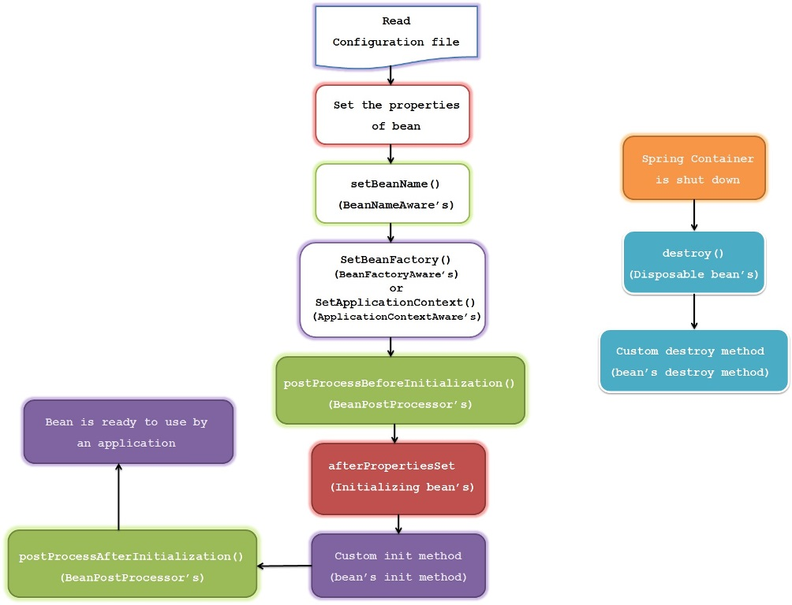

# Bean 的生命周期

> 译自 —— [Spring Bean Life Cycle](http://javainsimpleway.com/spring-bean-life-cycle/)

Bean 的生命周期是 Spring 最重要的特性之一。

在许多应用中，必须在初始化bean之前执行一些操作，并且在容器销毁bean之前执行一些清理操作。

在 Java 中 对象的生命周期 由 `new` 关键字开始。当我们使用 `new` 创建一个对象时，它会根据类的层析结构调用一系列的构造函数，最后使对象可用。当这个对象没有任何引用时，它将被垃圾收集。 这是Java中对象的生命周期。

但在 Spring 中 Bean 的生命周期还有很多事情要做。下面展示的是 Spring Bean 的生命周期图：

1. Spring容器在 xml配置文件中(注解扫描、配置Bean 等) 查找bean的定义
2. 通过调用 Class 的默认 无参数构造函数 来实例化 Bean；如果类中只有参数化构造函数，则必须在使用构造函数注入定义bean，否则将抛出bean创建异常。
3. Spring 将 值 或者 引用 注入到 Bean 的实例中
4. 如果 Bean 实现 `BeanNameAware` 接口，Spring 会将 bean的ID 传递给 `setBeanName()` 方法并执行此方法。
5. 如果 Bean 实现 `BeanFactoryAware` 接口，Spring 将会调用 `setBeanFactory()` 方法，传入 Bean 工厂 `BeanFactory` 的实例
6. 如果 Bean 实现 `ApplicationContextAware ` 接口，Spring 将会调用 `setApplicationContext()` 方法，创建当前应用上下问的引用 `ApplicationContext`
7. 如果 Bean 实现 `BeanPostProcessor` 接口，Spring 将会调用 `postProcessBeforeInitialization()` 方法；`@PostConstruct` 注解的方法也会在这一步执行
8. 如果 Bean 实现 `InitializingBean` 接口，Spring 将会 在设置完 Bean 的所有属性后 调用 `afterPropertiesSet()` 方法；类似地，如果使用 `init-method` 方法声明bean，则将调用指定的初始化方法
9. 如果 Bean 实现 `BeanPostProcessor` 接口，Spring 将会调用 `postProcessAfterInitialization()` 方法，
10. 此时，bean已准备好由应用程序使用，并将保留在应用程序上下文中，直到销毁应用程序上下文。
11. 如果 Bean 实现 `DisposableBean` 接口，Spring 将会在容器销毁的时候 调用 `destroy()` 方法；同样，如果使用 `destroy-method` 声明任何bean，则将调用指定的方法。

## 生命周期之前

1. 容器启动时最先调用 `org.springframework.beans.factory.config.BeanFactoryPostProcessor` # `postProcessBeanFactory(ConfigurableListableBeanFactory beanFactory)` 
2. ...

## @See

- `org.springframework.beans.factory.support.AbstractAutowireCapableBeanFactory` # `initializeBean` 